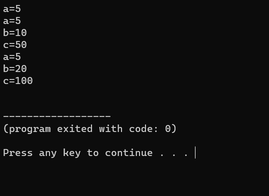

# BINARY SEARCH

## Code :

To view code [click here](./14_single_inheritance.cpp)

## Algorithm :

```Algorithm
    step 1: Start the process
    step 2: 
    step 3: 
    step 4: 
    step 5: 
    step 6: 
    step 7: 
    step 8: Stop the process
```

## Output :



To view Output [click here](./output.png)