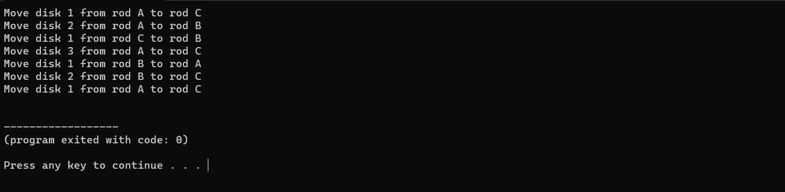

# TOWER OF HANOI

## Algorithm :

```Algorithm
    step 1: Start 
    step 2: Read from_rod,to_rod,aux_rod and n(number of disks)
    step 3: Call tower() 
    step 4: Stop
```

```
    tower(n,from_rod,to_rod,aux_rod)

        step 1: If n>1 repeat step from 2 to 4
        step 2: Call tower() method parameters are n-1,from_rod,
                aux_rod and to_rod respectively
        step 3: Print n, from_rod, to_rod
        step 4: Call tower() and also 
                    set n =n-1,
                    from_rod =aux_rod,
                    to_rod =to_rod and
                    aux_rod =from_rod as parameter
                    
```

## Output :

