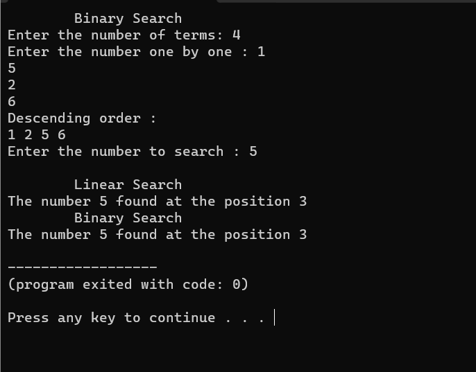

# BINARY SEARCH

## Code :

To view code [click here](./2_binary_search.cpp)

## Algorithm :

```Algorithm
    step 1: Start the process
    step 2: Declare the variables
    step 3: Using for loop insert the numbers into array
    step 4: Check the numbers and make it in ascending order
    step 5: Read the number to search in the array
    step 6: Check the number and its position using linear search
            method and binary search method
    step 7: Print the position of the number if it is available
            in the array
    step 8: Stop the process
```

## Output :



To view Output [click here](./output.png)